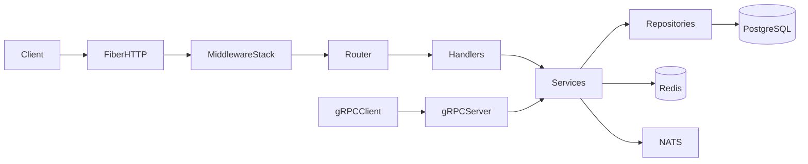

# fiber-v3-template

Production-ready Go API template built with [Fiber v3](https://github.com/gofiber/fiber), designed to be installed with a single interactive command and then trimmed to your real project scope.

## Quick Start

```bash
git clone https://github.com/eminbekov/fiber-v3-template.git my-project
cd my-project
./setup.sh
```

`setup.sh` does all initial setup in terminal:

1. Checks prerequisites (`go`, `git`, optional `docker`, `make`)
2. Asks your new module path (`github.com/you/project`)
3. Lets you keep/remove optional modules
4. Builds your `.env` from prompts
5. Runs `go mod tidy` and `gofmt`

## Requirements

- Go `1.26+` (repo currently uses `1.26.1`)
- Git
- Optional for containerized workflows: Docker + Docker Compose

## One-Command Installer

`setup.sh` is the primary entry point for new users.

### What it changes

- Rewrites module import path from `github.com/eminbekov/fiber-v3-template` to your chosen path
- Removes optional modules you disable (files + marker blocks)
- Regenerates `.env` interactively from `.env.example`
- Cleans dependencies/formatting

### Marker-based removal

Optional code sections are wrapped with:

```go
// [module:<key>:start]
// optional code
// [module:<key>:end]
```

The installer removes blocks for disabled modules and removes marker comments for enabled modules.

## Optional Module Catalog

| Module | Purpose | Main Paths | Key Env Vars |
|---|---|---|---|
| `nats` | Async events, JetStream consumers | `internal/nats`, `internal/nats/consumers` | `NATS_URL` |
| `grpc` | gRPC server and protobuf contracts | `internal/grpc`, `proto`, `gen` | `GRPC_LISTEN_ADDRESS` |
| `websocket` | Realtime websocket endpoint | `internal/websocket` | - |
| `admin` | Admin HTML login/dashboard area | `internal/handler/admin`, `views/admin` | uses session/cookie settings |
| `web` | Public HTML welcome area | `internal/handler/web`, `views/public` | - |
| `i18n` | Locale files + language middleware | `internal/i18n`, `internal/middleware/language.go` | - |
| `storage` | File upload/download and signed URLs | `internal/storage`, `uploads`, `internal/middleware/signed_url.go` | `STORAGE_TYPE`, `S3_*`, `FILE_SIGNING_KEY`, `SIGNED_URL_TTL` |
| `cron` | Separate cron binary + scheduler wiring | `cmd/cron`, `internal/cron` | - |
| `monitoring` | Local observability stack configs | `monitoring` | `OTEL_EXPORTER_ENDPOINT` (when using collector) |
| `swagger` | Generated OpenAPI docs and route | `docs` | - |

### Manual removal (without installer)

1. Delete module-owned directories/files
2. Remove module-specific env vars from `.env` / `.env.example`
3. Remove marker blocks for that module from:
   - `cmd/server/main.go`
   - `internal/router/router.go`
   - `internal/config/config.go`
   - `Makefile`
   - `deploy/docker/Dockerfile`
   - `deploy/docker/docker-compose.yml`
   - `deploy/docker/docker-compose.dev.yml`
4. Run:

```bash
go mod tidy
gofmt -s -w .
go build ./...
make lint
```

## Project Layout

```text
.
├── cmd/
│   ├── server/              # Main HTTP + app wiring
│   ├── migrate/             # Migration CLI
│   └── cron/                # Optional cron binary
├── deploy/docker/           # Dockerfile and compose manifests
├── internal/
│   ├── config/              # Env config parsing/validation
│   ├── database/            # pgx pool and DB helpers
│   ├── repository/          # Repository interfaces + postgres impl
│   ├── service/             # Business services
│   ├── handler/             # API, admin, and web handlers
│   ├── middleware/          # Request middleware stack
│   ├── nats/                # Optional NATS module
│   ├── grpc/                # Optional gRPC module
│   ├── websocket/           # Optional websocket module
│   └── storage/             # Optional storage module
├── migrations/              # SQL migrations
├── monitoring/              # Optional observability stack configs
├── views/                   # Optional HTML templates
├── .env.example
├── setup.sh
└── Makefile
```

## Configuration

Copy `.env.example` to `.env` (or run `./setup.sh` which generates it interactively).

| Variable | Required | Default | Description |
|---|---|---|---|
| `ENVIRONMENT` | No | `development` | `development` or `production` |
| `LOG_LEVEL` | No | `debug` | `debug`, `info`, `warn`, `error` |
| `HTTP_LISTEN_ADDRESS` | No | `:8080` | HTTP listen address |
| `VIEWS_PATH` | If HTML modules enabled | `./views` | Template root path |
| `CORS_ALLOW_ORIGINS` | No | empty | Comma-separated browser origins |
| `BODY_LIMIT` | No | `4194304` | Max request body bytes |
| `OTEL_EXPORTER_ENDPOINT` | No | empty | OTEL collector endpoint (`host:port`) |
| `DATABASE_URL` | Yes | none | PostgreSQL DSN |
| `REDIS_URL` | Yes | none | Redis URL |
| `NATS_URL` | If `nats` enabled | `nats://localhost:4222` | NATS server URL |
| `GRPC_LISTEN_ADDRESS` | If `grpc` enabled | `:9090` | gRPC bind address |
| `SESSION_DURATION` | No | `24h` | Session lifetime |
| `STORAGE_TYPE` | If `storage` enabled | `local` | `local` or `s3` |
| `STORAGE_LOCAL_BASE_PATH` | If local storage | `./uploads` | Local storage root |
| `S3_ENDPOINT` | If S3 storage | empty | MinIO/custom endpoint |
| `S3_BUCKET` | If S3 storage | none | Bucket name |
| `S3_ACCESS_KEY` | If S3 storage | none | Access key |
| `S3_SECRET_KEY` | If S3 storage | none | Secret key |
| `S3_REGION` | If S3 storage | none | Region |
| `CDN_BASE_URL` | Optional | empty | Public URL prefix |
| `FILE_SIGNING_KEY` | If storage enabled | none | HMAC key for file links |
| `SIGNED_URL_TTL` | If storage enabled | `15m` | Signed URL duration |

## Development Workflow

### Local run

```bash
go run ./cmd/server
```

### Common make targets

```bash
make build
make run
make lint
make migrate-up
make migrate-down
make help
```

### Docker workflows

Start only dependencies:

```bash
make docker-dev
```

Start full stack:

```bash
make up
```

Stop stack:

```bash
make down
```

Tail logs:

```bash
make logs
```

## Architecture Overview



## Endpoints

- `GET /health/live`
- `GET /health/ready`
- `GET /metrics`
- `GET /api/v1/ping`
- `POST /api/v1/auth/login`
- `POST /api/v1/auth/logout`
- `POST /api/v1/users`
- `GET /api/v1/users`
- `GET /api/v1/users/:id`
- `PUT /api/v1/users/:id`
- `DELETE /api/v1/users/:id`
- `POST /api/v1/files` (storage module)
- `GET /api/files/:filename` (storage module)
- `GET /ws` (websocket module)
- `GET /admin/login`, `POST /admin/login`, `POST /admin/logout`, `GET /admin/dashboard` (admin module)
- `GET /swagger/*` (swagger module, non-production)

## CI/CD

GitHub Actions:

- `.github/workflows/ci.yml`:
  - lint
  - tests
  - swagger generation check
  - image build/push on push events
- `.github/workflows/deploy.yml`:
  - manual deploy workflow (`workflow_dispatch`)

## Coding and Git Rules

This template follows:

- `GO_FIBER_PROJECT_GUIDE.md` (architecture, coding, testing, git practices)
- `AGENTS.md` (project-specific implementation rules)
- `CONVENTIONS.md` (coding conventions)

Minimum pre-push local checks:

```bash
gofmt -s -w .
go mod tidy
go build ./...
go vet ./...
make lint
go test -race -count=1 ./...
```

## FAQ

### Can I remove modules after setup?

Yes. Re-run from a fresh branch and remove by marker key/path ownership, then run `go mod tidy`, `go build`, and `make lint`.

### How do I add a migration?

```bash
make migrate-create NAME=create_orders
make migrate-up
```

### Do I need Docker?

No. You can run locally with native PostgreSQL/Redis/NATS and `go run ./cmd/server`.

### Can I use this as a minimal API template?

Yes. Disable HTML, gRPC, websocket, monitoring, storage, and NATS during `./setup.sh` to keep only API-focused components.
